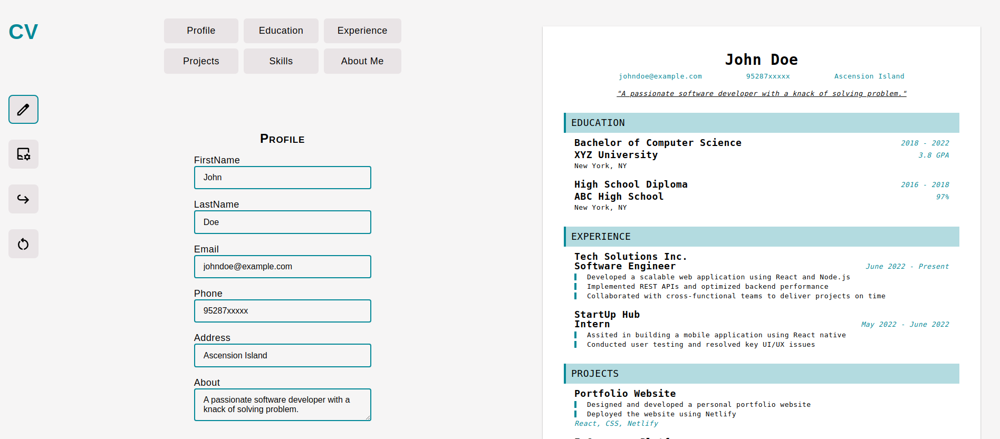

# CV Application

A small applicaation where users can input their information and generate a CV/résumé.

[Click to see live]()

## Assignment

- [x] A section to add general information like name, email and phone number
- [x] A section to add your educational experience (school name, title of study and date of study)
- [x] A section to add practical experience (company name, position title, main responsibilities of your jobs, date from and until when you worked for that company).
- [x] Deploy the results.

## Things I would like to add in future

- [ ] An option to delete whole section ,i.e., `Education` or `AboutMe`
- [ ] Add buttons to save or cancel during form editing to provide better controls
- [ ] Better overall layout of application
- [ ] Add option for downloading `CV` in pdf format
- [ ] Divide the CV in two pages if `CV` is too long
- [ ] Implement responsive design principles
